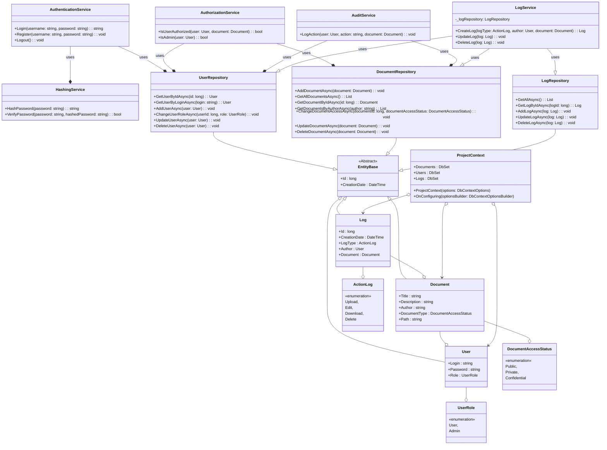

# Aplikacja do gromadzenia i archiwizacji dokumentów elektronicznych.

Celem aplikacji jest gromadzenie i przechowywani dokumentów w postaci dowolnych plików.

Każdy dokument zawiera metadane opisujące treść dokumentu: np. tytuł, typ pliku, opis zawartości, data utworzenia, kto go wprowadził do systemu oraz status udostępniania - publiczny, prywatny, poufny.

> **Publiczny** – każdy użytkownik (także nie zarejestrowany w systemie) może wyszukać lub pobrać dokument.

> **Prywatny** – tylko zarejestrowani użytkownicy mogą wyszukiwać lub pobierać taki dokument.

> **Poufny** – tylko użytkownicy o prawach typu Admin mogą wyszukiwać lub pobierać oraz ci, którzy ten dokument dodali do systemu.

# Operacje:
- Zarchiwizowanie (dodanie) dokumentu z opisem – każdy użytkownik może dodać dokument do systemu, który ma status publiczny. Użytkownicy zarejestrowani mogą dodawać dokumenty o dowolnym statusie.

- Odczyt i wyszukiwanie – użytkownicy niezarejestrowani mogą wyszukiwać i pobierać tylko dokumentu publiczne. Jeśli kryterium wyszukiwania pasuje do dokumentu niepublicznego to w wynikach wyszukiwanie nie powinien by ujawniany (użytkownik nie może nawet wiedzieć, że taki istnieje).

- Użytkownicy zarejestrowani o prawach oprócz Admi, mogą wyszukiwać i odczytywać dokumenty publiczne, prywatne oraz te poufne, które ten użytkownik dodał do systemu.

- Użytkownicy Admin maja prawo do wyszukiwania, pobierania, usuwania oraz modyfikacji opisu wszystkich dokumentów. Każda operacja edycji, pobrania, dodania musi być rejestrowana z informacjami: kto i kiedy wykonał daną operację na danym dokumencie. Historia wszystkich operacji wykonanych na dokumencie jest widoczna tylko dla Admin’ów.

- Każdy z użytkowników zarejestrowanych może dostać listę dokumentów, które sam wprowadził do systemu.

# Instrukcja uruchomienia:
- Sklonuj repozytorum,
- Otwórz rozwiązanie,
- W projekcie WebAPI znajduje się plik appsetings.json zawierający właściwość domyślnej ścieżki połączenia z serwerem bazodanowym, upewnij się że ścieżka pokrywa się ze ścieżką serwera którego zamierzasz urzywać,
- Skompiluj, aplikacja sama utworzy baze danych i wprowadzi wbudowane rekordy testowe.

# Rekordy wbudowane
- **Użytkownicy**
    1. (Id:1) admin admin (Administrator)
    2. (Id:2) user user (Zarajestrowany użytkownik)
    3. (Id:3) user2 user2 (Zarajestrowany użytkownik)
    4. (Id:4) guest guest (Niezarajestrowany użytkownik)
 
- **Dokumenty**
    Wszytkie dokumenty wprowadzone zostały przez użytkownika (Id:2) User
    1. (Id:1) Public (Publiczny)
    2. (Id:2) Private (Prywatny)
    3. (Id:3) Confidential (Poufny)

- **Logi**
    1. (Id:1) Upload, Użytkownik (Id: 2), Dokument (Id: 1)
    2. (Id:2) Upload, Użytkownik (Id: 2), Dokument (Id: 2)
    3. (Id:3) Upload, Użytkownik (Id: 2), Dokument (Id: 3)
     
# Diagram:

# Technologie wukorzystane przy projekcie
- [Microsoft.AspNet.Mvc](https://www.nuget.org/packages/Microsoft.AspNet.Mvc/5.2.9?_src=template)
- [Microsoft.EntityFrameworkCore](https://www.nuget.org/packages/Microsoft.EntityFrameworkCore/7.0.5?_src=template)
- [Microsoft.EntityFrameworkCore.SqlServer](https://www.nuget.org/packages/Microsoft.EntityFrameworkCore.SqlServer)
- [Microsoft.AspNetCore.OpenApi](https://www.nuget.org/packages/Microsoft.AspNetCore.OpenApi/)
- [Microsoft.EntityFrameworkCore.Tools](https://www.nuget.org/packages/Microsoft.EntityFrameworkCore.Tools/8.0.0-preview.5.23280.1)
- [Swashbuckle.AspNetCore](https://www.nuget.org/packages/Swashbuckle.AspNetCore)

# Autorzy
- [Krystian Żywiec **kZywiec**](https://github.com/kZywiec)
- [Mieszko Przybyła **emzetp**](https://github.com/https://github.com/emzetp)
- [Krzysztof Nowakowski **knowakowski78**](https://github.com/knowakowski78)
