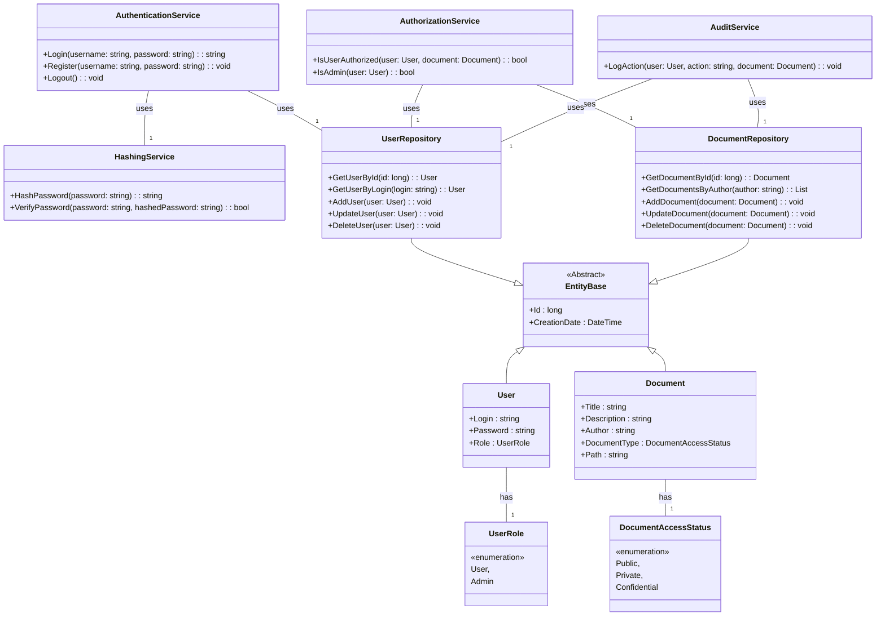

# Aplikacja do gromadzenia i archiwizacji dokumentów elektronicznych.

Celem aplikacji jest gromadzenie i przechowywani dokumentów w postaci dowolnych plików.

Każdy dokument zawiera metadane opisujące treść dokumentu: np. tytuł, typ pliku, opis zawartości, data utworzenia, kto go wprowadził do systemu oraz status udostępniania - publiczny, prywatny, poufny.

> **Publiczny** – każdy użytkownik (także nie zarejestrowany w systemie) może wyszukać lub pobrać dokument.

> **Prywatny** – tylko zarejestrowani użytkownicy mogą wyszukiwać lub pobierać taki dokument.

> **Poufny** – tylko użytkownicy o prawach typu Admin mogą wyszukiwać lub pobierać oraz ci, którzy ten dokument dodali do systemu.

# Operacje
- Zarchiwizowanie (dodanie) dokumentu z opisem – każdy użytkownik może dodać dokument do systemu, który ma status publiczny. Użytkownicy zarejestrowani mogą dodawać dokumenty o dowolnym statusie.

- Odczyt i wyszukiwanie – użytkownicy niezarejestrowani mogą wyszukiwać i pobierać tylko dokumentu publiczne. Jeśli kryterium wyszukiwania pasuje do dokumentu niepublicznego to w wynikach wyszukiwanie nie powinien by ujawniany (użytkownik nie może nawet wiedzieć, że taki istnieje).

- Użytkownicy zarejestrowani o prawach oprócz Admi, mogą wyszukiwać i odczytywać dokumenty publiczne, prywatne oraz te poufne, które ten użytkownik dodał do systemu.

- Użytkownicy Admin maja prawo do wyszukiwania, pobierania, usuwania oraz modyfikacji opisu wszystkich dokumentów. Każda operacja edycji, pobrania, dodania musi być rejestrowana z informacjami: kto i kiedy wykonał daną operację na danym dokumencie. Historia wszystkich operacji wykonanych na dokumencie jest widoczna tylko dla Admin’ów.

- Każdy z użytkowników zarejestrowanych może dostać listę dokumentów, które sam wprowadził do systemu.

#
Dodatkowe funkcje ponoszące ocenę z projektu: Pobieranie skompresowanej paczki dokumentów np. aplikacja korzysta z serwisu gRCP, który wykonuje kompresję plików, umieszcza plik wynikowy na serwerze i zwraca link do archiwum.  

# Autorzy
- [Krystian Żywiec **kZywiec**](https://github.com/kZywiec)
- [Mieszko Przybyła]()
- [Krzysztof Tybinka](https://github.com/KrzysztofTybinka)
- [Krzysztof Nowakowski]()
